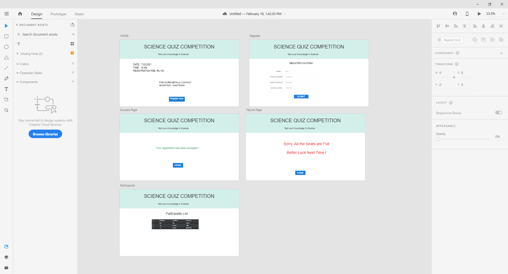
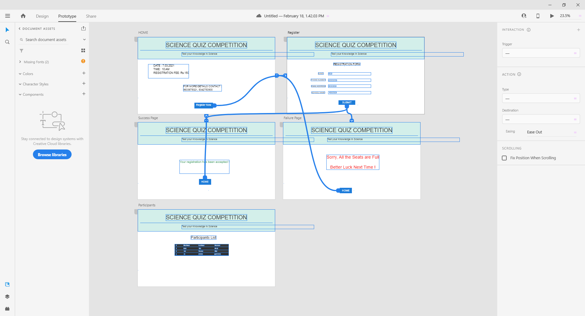
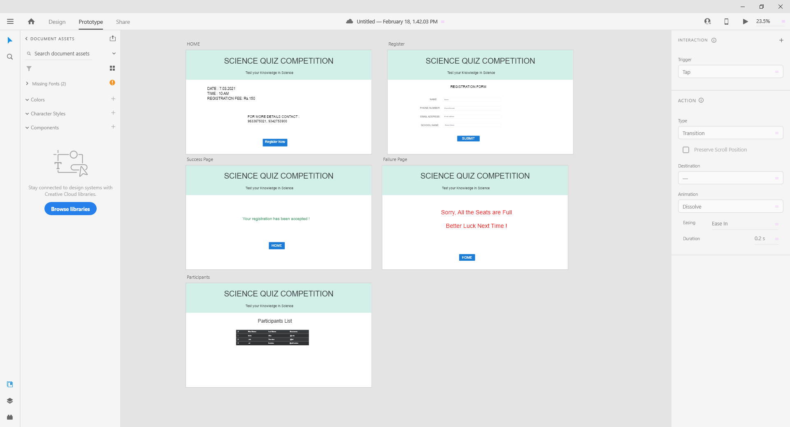
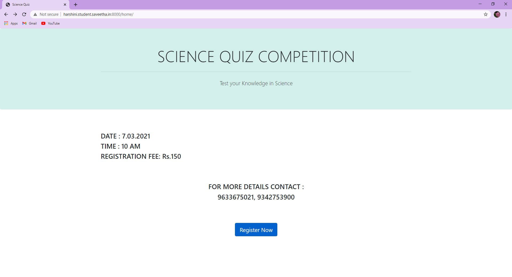
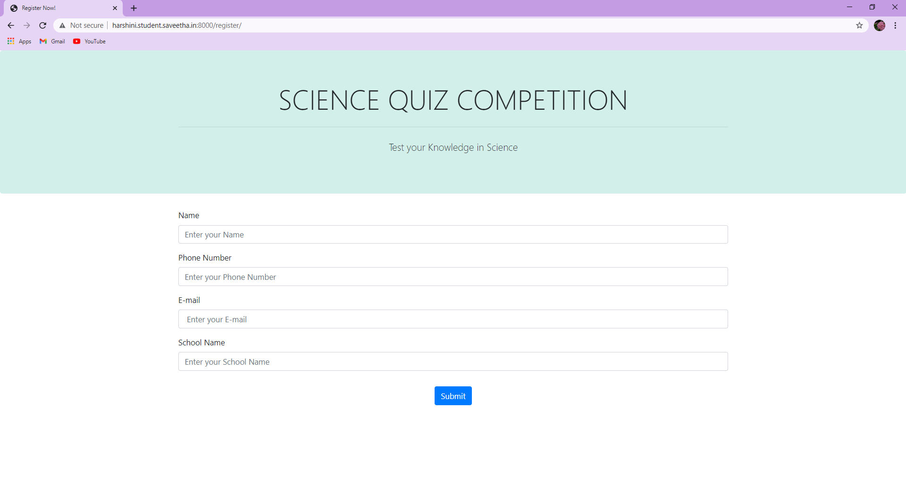
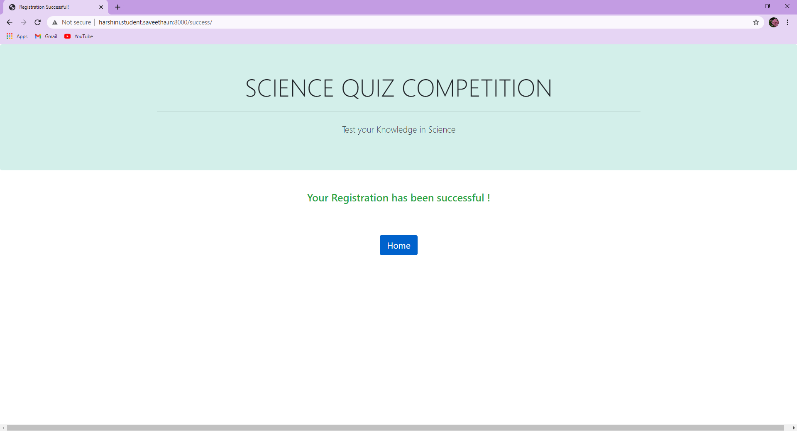
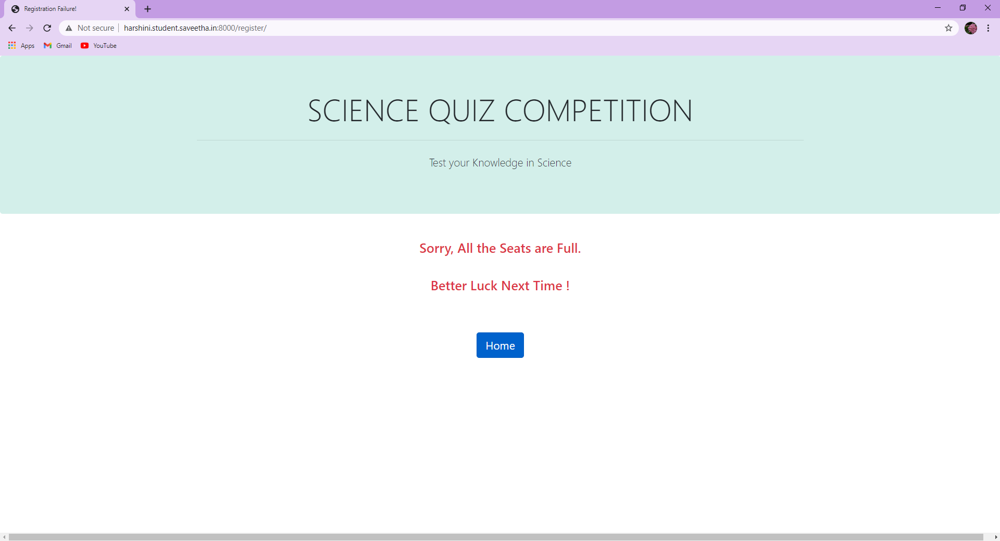
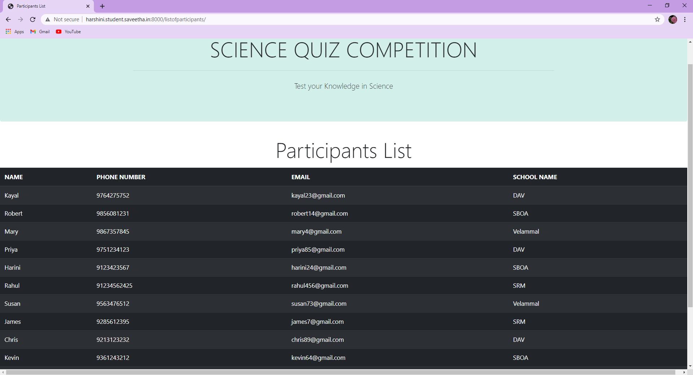

# WebApplication for Event Registration

## AIM:
To create a UX design and develop a web application for event registration.
## DESIGN STEPS:


## DESIGN SCREENS:


## WIREFRAME:


## PROTOTYPE:


## PROGRAM:

### home.html
```
<!doctype html>
<html lang="en">

<head>
    <!-- Required meta tags -->
    <meta charset="utf-8">
    <meta name="viewport" content="width=device-width, initial-scale=1, shrink-to-fit=no">

    <!-- Bootstrap CSS -->
    <link rel="stylesheet" href="https://maxcdn.bootstrapcdn.com/bootstrap/4.0.0/css/bootstrap.min.css"
        integrity="sha384-Gn5384xqQ1aoWXA+058RXPxPg6fy4IWvTNh0E263XmFcJlSAwiGgFAW/dAiS6JXm" crossorigin="anonymous">

    <title>Science Quiz</title>
</head>

<body>
    <div class="jumbotron" style="background-color: #D3EFEA;">
        <div class="container text-center">
            <h1 class="display-4">SCIENCE QUIZ COMPETITION</h1>
            <hr class="my-4">
            <p class="lead">Test your Knowledge in Science</p>
        </div>
    </div>
        <div class="container py-5">
            <div class="row">

                <div class="col-12">
                    <h4>DATE : 7.03.2021</h4>
                    <h4>TIME : 10 AM</h4>
                    <h4>REGISTRATION FEE: Rs.150</h4>
                </div>
            </div>
            <br>
            <div class="container py-5 ">
                <div class="row text-center">
                    <div class="col-12">
                        <h4>FOR MORE DETAILS CONTACT :</h4>
                        <h4>9633675021, 9342753900</h4>
                    </div>
                </div>
            </div>
            <br>
            <div class="row">
                <div class="col-12 text-center">
                    <a href="/register/" class="btn btn-primary btn-lg active" role="button"
                        aria-pressed="true">Register
                        Now</a>
                </div>
            </div>
        </div>
    

    <!-- Optional JavaScript -->
    <!-- jQuery first, then Popper.js, then Bootstrap JS -->
    <script src="https://code.jquery.com/jquery-3.2.1.slim.min.js"
        integrity="sha384-KJ3o2DKtIkvYIK3UENzmM7KCkRr/rE9/Qpg6aAZGJwFDMVNA/GpGFF93hXpG5KkN"
        crossorigin="anonymous"></script>
    <script src="https://cdnjs.cloudflare.com/ajax/libs/popper.js/1.12.9/umd/popper.min.js"
        integrity="sha384-ApNbgh9B+Y1QKtv3Rn7W3mgPxhU9K/ScQsAP7hUibX39j7fakFPskvXusvfa0b4Q"
        crossorigin="anonymous"></script>
    <script src="https://maxcdn.bootstrapcdn.com/bootstrap/4.0.0/js/bootstrap.min.js"
        integrity="sha384-JZR6Spejh4U02d8jOt6vLEHfe/JQGiRRSQQxSfFWpi1MquVdAyjUar5+76PVCmYl"
        crossorigin="anonymous"></script>
</body>

</html>
```
### register.html
```
<!doctype html>
<html lang="en">

<head>
    <!-- Required meta tags -->
    <meta charset="utf-8">
    <meta name="viewport" content="width=device-width, initial-scale=1, shrink-to-fit=no">

    <!-- Bootstrap CSS -->
    <link rel="stylesheet" href="https://maxcdn.bootstrapcdn.com/bootstrap/4.0.0/css/bootstrap.min.css"
        integrity="sha384-Gn5384xqQ1aoWXA+058RXPxPg6fy4IWvTNh0E263XmFcJlSAwiGgFAW/dAiS6JXm" crossorigin="anonymous">

    <title>Register Now!</title>
</head>

<body>
    <div class="jumbotron" style="background-color: #D3EFEA;">
        <div class="container text-center">
            <h1 class="display-4">SCIENCE QUIZ COMPETITION</h1>
            <hr class="my-4">
            <p class="lead">Test your Knowledge in Science</p>
        </div>
    </div>
    <div class="container">
        <div class="row">
            <div class="col-12">
                <form action="/register/" method="POST">
                    
                    <div class="form-group">
                        <label for="name">Name</label>
                        <input type="name" class="form-control" id="name" name="name" placeholder="Enter your Name">
                    </div>
                    <div class="form-group">
                        <label for="phonenumber">Phone Number</label>
                        <input type="phone" class="form-control" id="phonenumber" name="phonenumber"
                            placeholder="Enter your Phone Number">
                    </div>
                    <div class="form-group">
                        <label for="email">E-mail</label>
                        <input type="text" class="form-control" id="email" name="email"
                            placeholder=" Enter your E-mail">
                    </div>

                    <div class="form-group">
                        <label for="schoolname">School Name</label>
                        <input type="text" class="form-control" id="schoolname" name="schoolname"
                            placeholder="Enter your School Name">
                    </div>
                    <div class="col-12 text-center py-3">
                    <button type="submit" class="btn btn-primary">Submit</button>
                    </div>
            </div>
            </form>
        </div>
    </div>


    </div>

    <!-- Optional JavaScript -->
    <!-- jQuery first, then Popper.js, then Bootstrap JS -->
    <script src="https://code.jquery.com/jquery-3.2.1.slim.min.js"
        integrity="sha384-KJ3o2DKtIkvYIK3UENzmM7KCkRr/rE9/Qpg6aAZGJwFDMVNA/GpGFF93hXpG5KkN"
        crossorigin="anonymous"></script>
    <script src="https://cdnjs.cloudflare.com/ajax/libs/popper.js/1.12.9/umd/popper.min.js"
        integrity="sha384-ApNbgh9B+Y1QKtv3Rn7W3mgPxhU9K/ScQsAP7hUibX39j7fakFPskvXusvfa0b4Q"
        crossorigin="anonymous"></script>
    <script src="https://maxcdn.bootstrapcdn.com/bootstrap/4.0.0/js/bootstrap.min.js"
        integrity="sha384-JZR6Spejh4U02d8jOt6vLEHfe/JQGiRRSQQxSfFWpi1MquVdAyjUar5+76PVCmYl"
        crossorigin="anonymous"></script>
</body>

</html>
```
### success.html
```
<!doctype html>
<html lang="en">
  <head>
    <!-- Required meta tags -->
    <meta charset="utf-8">
    <meta name="viewport" content="width=device-width, initial-scale=1, shrink-to-fit=no">

    <!-- Bootstrap CSS -->
    <link rel="stylesheet" href="https://maxcdn.bootstrapcdn.com/bootstrap/4.0.0/css/bootstrap.min.css" integrity="sha384-Gn5384xqQ1aoWXA+058RXPxPg6fy4IWvTNh0E263XmFcJlSAwiGgFAW/dAiS6JXm" crossorigin="anonymous">

    <title>Registration Successful!</title>
  </head>
  <body>
      <div class="jumbotron" style="background-color: #D3EFEA;">
        <div class="container text-center">
            <h1 class="display-4">SCIENCE QUIZ COMPETITION</h1>
            <hr class="my-4">
            <p class="lead">Test your Knowledge in Science</p>
        </div>
    </div>
    <div class="row">
        <div class="col-12 text-center text-success py-3">
           <h4> Your Registration has been successful !</h4>
        </div>
    </div>
    <div class="row py-5">
            <div class="col-12 text-center">
                <a href="/home/" class="btn btn-primary btn-lg active" role="button" aria-pressed="true">Home</a>
            </div>
    </div>

    <!-- Optional JavaScript -->
    <!-- jQuery first, then Popper.js, then Bootstrap JS -->
    <script src="https://code.jquery.com/jquery-3.2.1.slim.min.js" integrity="sha384-KJ3o2DKtIkvYIK3UENzmM7KCkRr/rE9/Qpg6aAZGJwFDMVNA/GpGFF93hXpG5KkN" crossorigin="anonymous"></script>
    <script src="https://cdnjs.cloudflare.com/ajax/libs/popper.js/1.12.9/umd/popper.min.js" integrity="sha384-ApNbgh9B+Y1QKtv3Rn7W3mgPxhU9K/ScQsAP7hUibX39j7fakFPskvXusvfa0b4Q" crossorigin="anonymous"></script>
    <script src="https://maxcdn.bootstrapcdn.com/bootstrap/4.0.0/js/bootstrap.min.js" integrity="sha384-JZR6Spejh4U02d8jOt6vLEHfe/JQGiRRSQQxSfFWpi1MquVdAyjUar5+76PVCmYl" crossorigin="anonymous"></script>
  </body>
</html>
```
### failure.html
```
<!doctype html>
<html lang="en">
  <head>
    <!-- Required meta tags -->
    <meta charset="utf-8">
    <meta name="viewport" content="width=device-width, initial-scale=1, shrink-to-fit=no">

    <!-- Bootstrap CSS -->
    <link rel="stylesheet" href="https://maxcdn.bootstrapcdn.com/bootstrap/4.0.0/css/bootstrap.min.css" integrity="sha384-Gn5384xqQ1aoWXA+058RXPxPg6fy4IWvTNh0E263XmFcJlSAwiGgFAW/dAiS6JXm" crossorigin="anonymous">

    <title>Registration Failure!</title>
  </head>
  <body>
      <div class="jumbotron" style="background-color: #D3EFEA;">
        <div class="container text-center">
            <h1 class="display-4">SCIENCE QUIZ COMPETITION</h1>
            <hr class="my-4">
            <p class="lead">Test your Knowledge in Science</p>
        </div>
    </div>
    <div class="row">
        <div class="col-12 text-center text-danger py-3">
            <h4>Sorry, All the Seats are Full.</h4>
        </div>
    </div>
    <div class="row">
        <div class="col-12 text-center text-danger py-3">
          <h4> Better Luck Next Time !</h4> 
        </div>
    </div>
    <div class="row py-5">
            <div class="col-12 text-center">
                <a href="/home/" class="btn btn-primary btn-lg active" role="button" aria-pressed="true">Home</a>
            </div>
    </div>

    <!-- Optional JavaScript -->
    <!-- jQuery first, then Popper.js, then Bootstrap JS -->
    <script src="https://code.jquery.com/jquery-3.2.1.slim.min.js" integrity="sha384-KJ3o2DKtIkvYIK3UENzmM7KCkRr/rE9/Qpg6aAZGJwFDMVNA/GpGFF93hXpG5KkN" crossorigin="anonymous"></script>
    <script src="https://cdnjs.cloudflare.com/ajax/libs/popper.js/1.12.9/umd/popper.min.js" integrity="sha384-ApNbgh9B+Y1QKtv3Rn7W3mgPxhU9K/ScQsAP7hUibX39j7fakFPskvXusvfa0b4Q" crossorigin="anonymous"></script>
    <script src="https://maxcdn.bootstrapcdn.com/bootstrap/4.0.0/js/bootstrap.min.js" integrity="sha384-JZR6Spejh4U02d8jOt6vLEHfe/JQGiRRSQQxSfFWpi1MquVdAyjUar5+76PVCmYl" crossorigin="anonymous"></script>
  </body>
</html>
```
### listofparticipants.html
```
<!doctype html>
<html lang="en">
  <head>
    <!-- Required meta tags -->
    <meta charset="utf-8">
    <meta name="viewport" content="width=device-width, initial-scale=1, shrink-to-fit=no">

    <!-- Bootstrap CSS -->
    <link rel="stylesheet" href="https://maxcdn.bootstrapcdn.com/bootstrap/4.0.0/css/bootstrap.min.css" integrity="sha384-Gn5384xqQ1aoWXA+058RXPxPg6fy4IWvTNh0E263XmFcJlSAwiGgFAW/dAiS6JXm" crossorigin="anonymous">

    <title>Participants List</title>
  </head>
  <body>
    <div class="jumbotron" style="background-color: #D3EFEA;">
    <div class="container text-center">
    <h1 class="display-4">SCIENCE QUIZ COMPETITION</h1>
    <hr class="my-4">
    <p class="lead">Test your Knowledge in Science</p>
    </div>
    </div>
    <div class="row text-center py-2">
        <div class="col-12">
        <h4 class="display-4">Participants List</h4>
        </div>
    </div>
    <div class="row">
        <div class="col-12">
            <table class="table table-dark table-striped">
                <thead>
                    <tr>
                        <th scope="col">NAME</th>
                        <th scope="col">PHONE NUMBER</th>
                        <th scope="col">EMAIL</th>
                        <th scope="col">SCHOOL NAME</th>
                    </tr>
                </thead>
                <tbody>
                    
                    <tr>
                        <td>{{ p.name }}</td>
                        <td>{{ p.phonenumber }}</td>
                        <td>{{ p.email }}</td>
                        <td>{{ p.schoolname }}</td>
                    </tr>
                    
                </tbody>
            </table>
        </div>
    </div>
    <div class="row py-5">
            <div class="col-12 text-center">
                <a href="/home/" class="btn btn-primary btn-lg active" role="button" aria-pressed="true">Home</a>
            </div>
    </div>

    <!-- Optional JavaScript -->
    <!-- jQuery first, then Popper.js, then Bootstrap JS -->
    <script src="https://code.jquery.com/jquery-3.2.1.slim.min.js" integrity="sha384-KJ3o2DKtIkvYIK3UENzmM7KCkRr/rE9/Qpg6aAZGJwFDMVNA/GpGFF93hXpG5KkN" crossorigin="anonymous"></script>
    <script src="https://cdnjs.cloudflare.com/ajax/libs/popper.js/1.12.9/umd/popper.min.js" integrity="sha384-ApNbgh9B+Y1QKtv3Rn7W3mgPxhU9K/ScQsAP7hUibX39j7fakFPskvXusvfa0b4Q" crossorigin="anonymous"></script>
    <script src="https://maxcdn.bootstrapcdn.com/bootstrap/4.0.0/js/bootstrap.min.js" integrity="sha384-JZR6Spejh4U02d8jOt6vLEHfe/JQGiRRSQQxSfFWpi1MquVdAyjUar5+76PVCmYl" crossorigin="anonymous"></script>
  </body>
</html>
```
### models.py
```
from django.db import models

# Create your models here.
from django.contrib import admin
class Participant(models.Model):
    name=models.CharField(max_length=50)
    email=models.CharField(max_length=50)
    phonenumber=models.CharField(max_length=50)
    schoolname=models.CharField(max_length=50)

class ParticipantAdmin(admin.ModelAdmin):
    list_display=("name","email","phonenumber","schoolname")
```

### views.py
```
from django.shortcuts import render
from .models import Participant
from django.core.exceptions import ValidationError

# Create your views here.
def home(request):
    context = {}
    return render(request, 'eventapplication/home.html', context)

def register(request):
    context = {}
    if request.method == 'POST':
        p1 = Participant()
        p1.name = request.POST.get('name','-')
        p1.email = request.POST.get('email','-')
        p1.phonenumber = request.POST.get('phonenumber','000')
        p1.schoolname = request.POST.get('schoolname','-')

        if len(Participant.objects.all()) > 10:
            return render(request, 'eventapplication/failure.html', context)
        else:
            p1.save()
            return render(request, 'eventapplication/success.html', context)

    if request.method == 'GET':
        context['name'] = ''
        context['email'] = ''
        context['phonenumber'] = ''
        context['schoolname'] = ''

    return render(request, 'eventapplication/register.html', context)

def listofparticipants(request):
    context = {}

    context['participants'] = Participant.objects.all()
    
    return render(request, 'eventapplication/listofparticipants.html', context)

def success(request):
    context = {}
    return render(request, 'eventapplication/success.html', context)

def failure(request):
    context = {}
    return render(request, 'eventapplication/failure.html', context)
```


## OUTPUT:







## RESULT:
Thus, a UX design is created and a web application for event registration is developed and is hosted in the URL http://harshini.student.saveetha.in:8000/home/.